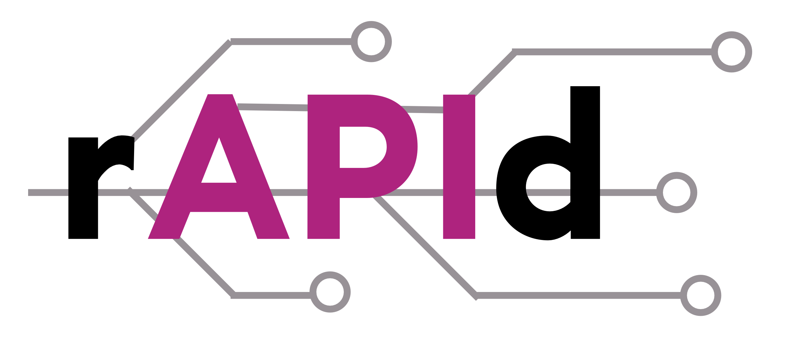

 

# Project rAPId

# Product Vision

Project rAPId aims to create consistent, secure, interoperable data storage and sharing interfaces (APIs) that enable
departments to discover, manage and share data and metadata amongst themselves.

This will improve the government's use of data by making it more scalable, secure, and resilient, helping to
match the rising demand for good-quality evidence in the design, delivery, and evaluation of public policy.

The project aims to deliver a replicable template for simple data storage infrastructure in AWS, a RESTful API and custom frontend UI to
ingest and share named, standardised datasets.

# Getting Started

See the [documentation](https://rapid.readthedocs.io/en/latest/) for more details