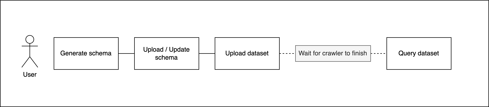
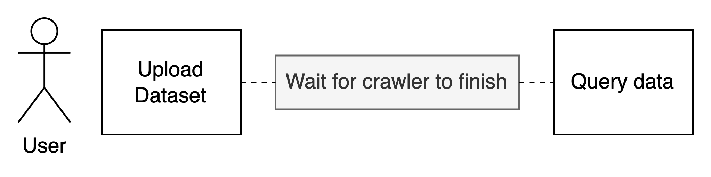
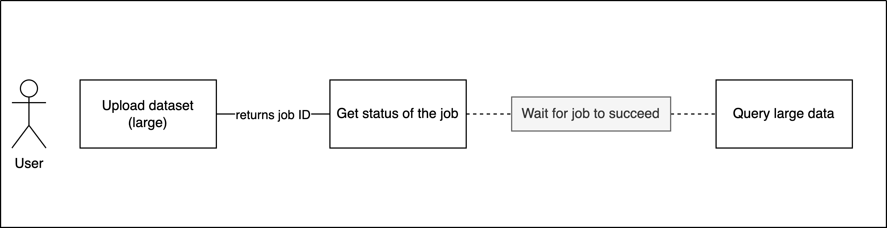

# rAPId API Usage Guide

The rAPId API serves to make data storage and retrieval consistent for all users involved.

Overarching API functionality includes:

- [Uploading a schema (i.e.: creating a new dataset definition)](#upload-schema)
    - Also creating a new version of an existing schema
- [Uploading data to any version of a dataset](#upload-dataset)
- [Listing available data](#list-datasets)
- [Querying data from any version of a dataset](#query-dataset)
- [Deleting data](#delete-data-file)
- Creating [users](#create-user) and [clients](#create-client)
- [Managing user and client permissions](#modify-subject-permissions)
- [UI Usage](#ui-usage)

# Application usage overview

The first step is to create a dataset by uploading a schema that describes the metadata including e.g.: data owner,
tags, partition columns, data types, auto-generated version, etc..

Then the data (currently only `.csv` files are supported) can be uploaded to the dataset. During the upload process, the
service checks if the data matches the previously uploaded dataset schema definition and transforms it into `.parquet`. The data can then be queried.

The application can be used by both human and programmatic clients (see more below)

- When accessing the REST API as a client application, different actions require the client to have different
  permissions e.g.:`READ`, `WRITE`, `DATA_ADMIN`, etc., and different dataset sensitivity level permissions
  e.g.: `PUBLIC`, `PRIVATE`, etc.
- When accessing the UI as a human user, permissions are granted by the permissions' database, e.g.: `WRITE_PUBLIC`

## Data upload and query flows

### No schema exists + upload data + query



### Schema exists + upload data + query



### Schema exists + upload large dataset + query



# How to authorise

There are two types of 'subjects':

- Human users (using the frontend UI)
- Programmatic clients / 'client-app' (calling the API endpoints directly)

## Granting permissions

Both human users and programmatic clients are managed in the same way.

When creating a user/client-app via the `/user` or `/client` endpoints, permissions can immediately be granted.

To update permissions, a user administrator will need to use the frontend application and click 'Modify user'.

# Authenticating and interacting with the application

## Client app

### Using the OpenApi docs at `/docs`:

1. Hit the Authorise button
2. Pass `client id` and `client secret`
3. Access the endpoints

### Via programmatic access:

See the [scripts](./scripts/) section for examples of programmatic client interaction.

The general concept is to retrieve an access token using client credentials and making subsequent requests passing that
token.

## Human user

### Via the UI

> ℹ️ Note that you must already have a user account. This can be created by a user admin via the UI or relevant endpoint.

Clicking 'Login' on the `/login` page will redirect the user to Cognito, whereupon they will be prompted to enter their
username and password. This will grant them a temporary access token and redirect them to the home page.

# Endpoint usage

The following documents the usage of the available endpoints exposed by the REST API.

[//]: # (Dataset management)

## Generate schema

In order to upload the dataset for the first time, you need to define its schema. This endpoint is provided for your
convenience to generate a schema based on an existing dataset. Alternatively you can consult
the [schema writing guide](schema_creation.md) if you would like to create the schema yourself. You can then use the
output of this endpoint in the Schema Upload endpoint.

### General structure

`POST /schema/{sensitivity}/{domain}/{dataset}/generate`

### Inputs

| Parameters    | Usage                                   | Example values               | Definition                 |
|---------------|-----------------------------------------|------------------------------|----------------------------|
| `layer`       | URL parameter                           | `default`                    | layer of the dataset       |
| `sensitivity` | URL parameter                           | `PUBLIC, PRIVATE, PROTECTED` | sensitivity of the dataset |
| `domain`      | URL parameter                           | `land`                       | domain of the dataset      |
| `dataset`     | URL parameter                           | `train_journeys`             | dataset title              |
| `file`        | File in form data with key value `file` | `train_journeys.csv`         | the dataset file itself    |

### Outputs

Schema in json format in the response body:

```json
{
  "metadata": {
    "layer": "default",
    "domain": "land",
    "dataset": "train_journeys",
    "sensitivity": "PUBLIC",
    "key_value_tags": {},
    "key_only_tags": [],
    "owners": [
      {
        "name": "change_me",
        "email": "change_me@email.com"
      }
    ],
    "update_behaviour": "APPEND"
  },
  "columns": [
    {
      "name": "date",
      "partition_index": 0,
      "data_type": "date",
      "format": "%d/%m/%Y",
      "allow_null": false
    },
    {
      "name": "num_journeys",
      "partition_index": null,
      "data_type": "integer",
      "allow_null": false
    }
  ]
}
```

### Accepted permissions

In order to use this endpoint you don't need any permission.

### Examples

#### Example 1:

- Request url: `/schema/default/PRIVATE/land/train_journeys/generate`
- Form data: `file=train_journeys.csv`

#### Example 2:

- Request url: `/schema/default/PUBLIC/sea/ferry_crossings/generate`
- Form data: `file=ferry_crossings.csv`

## Upload schema

### General structure

When you have a schema definition you can use this endpoint to upload it. This will allow you to subsequently upload
datasets that match the schema. If you do not yet have a schema definition, you can craft this yourself (see
the [schema writing guide](schema_creation.md)) or use the Schema Generation endpoint (see above).

### General structure

`POST /schema`

### Inputs

| Parameters    | Usage                                   | Example values               | Definition            |
|---------------|-----------------------------------------|------------------------------|-----------------------|
| schema        | JSON request body                       | see below                    | the schema definition |

Example schema JSON body:

```json
{
  "metadata": {
    "layer": "default",
    "domain": "land",
    "dataset": "train_journeys",
    "sensitivity": "PUBLIC",
    "key_value_tags": {
      "train": "passenger"
    },
    "key_only_tags": [
      "land"
    ],
    "owners": [
      {
        "name": "Stanley Shunpike",
        "email": "stan.shunpike@email.com"
      }
    ],
    "update_behaviour": "APPEND"
  },
  "columns": [
    {
      "name": "date",
      "partition_index": 0,
      "data_type": "date",
      "format": "%d/%m/%Y",
      "allow_null": false
    },
    {
      "name": "num_journeys",
      "partition_index": null,
      "data_type": "integer",
      "allow_null": false
    }
  ]
}
```

### Outputs

None

### Accepted permissions

In order to use this endpoint you need the `DATA_ADMIN` permission.

## Update schema (new dataset version)

### General structure

This endpoint is for uploading an updated schema definition. This will allow you to subsequently upload datasets that
match the updated schema. To create a schema definition (see the
[schema writing guide](https://github.com/no10ds/rapid-api/blob/main/docs/guides/usage/schema_creation.md)) or use the
Schema Generation endpoint (see above).

### General structure

`PUT /schema`

### Inputs

| Parameters    | Usage                                   | Example values               | Definition            |
|---------------|-----------------------------------------|------------------------------|-----------------------|
| schema        | JSON request body                       | see below                    | the schema definition |

Example schema JSON body:

```json
{
  "metadata": {
    "layer": "layer",
    "domain": "land",
    "dataset": "train_journeys",
    "key_value_tags": {
      "train": "passenger"
    },
    "key_only_tags": [
      "land"
    ],
    "owners": [
      {
        "name": "Stanley Shunpike",
        "email": "stan.shunpike@email.com"
      }
    ],
    "update_behaviour": "APPEND"
  },
  "columns": [
    {
      "name": "date",
      "partition_index": 0,
      "data_type": "date",
      "format": "%d/%m/%Y",
      "allow_null": false
    },
    {
      "name": "num_journeys",
      "partition_index": null,
      "data_type": "integer",
      "allow_null": false
    }
  ]
}
```

### Outputs

The schema path

### Accepted permissions

In order to use this endpoint you need the `DATA_ADMIN` permission.

## Upload dataset

Given a schema has been uploaded you can upload data which matches that schema. Uploading a CSV file via this endpoint
ensures that the data matches the schema and that it is consistent and sanitised.

The upload triggers an asynchronous job that is processed in the background. The response contains a job ID that you can
use to check the status of the upload via the `/jobs/{job_id}` endpoint. Alternatively you can check the tasks status
page in the UI.

Should any errors be detected during processing the upload, these are made visible in the job status page to facilitate
you fixing the issues.

### General structure

`POST /datasets/{layer}/{domain}/{dataset}`

### Inputs

| Parameters | Required | Usage                                   | Example values              | Definition              |
|------------|----------|-----------------------------------------|-----------------------------|-------------------------|
| `layer`    | True     | URL parameter                           | `default`                   | layer of the dataset    |
| `domain`   | True     | URL parameter                           | `air`                       | domain of the dataset   |
| `dataset`  | True     | URL parameter                           | `passengers_by_airport`     | dataset title           |
| `version`  | False    | Query parameter                         | `3`                         | dataset version         |
| `file`     | True     | File in form data with key value `file` | `passengers_by_airport.csv` | the dataset file itself |

### Output

If successful returns file name with a timestamp included, e.g.:

```json
{
  "details": {
    "original_filename": "the-filename.csv",
    "raw_filename": "661c9467-5d0e-4ec7-ad05-b8651598b675.csv",
    "dataset_version": 3,
    "status": "Data processing",
    "job_id": "3bd7d98f-2264-4f88-bd65-5a2089161650"
  }
}
```

### Accepted permissions

In order to use this endpoint you need a relevant `WRITE` permission that matches the dataset sensitivity level,
e.g.: `WRITE_ALL`, `WRITE_PUBLIC`, `WRITE_PRIVATE`, `WRITE_PROTECTED_{DOMAIN}`

### Examples

#### Example 1:

- Request url: `/datasets/default/land/train_journeys?version=3`
- Form data: `file=train_journeys.csv`

#### Example 2:

- Request url: `/datasets/default/air/passengers_by_airport?version=2`
- Form data: `file=passengers_by_airport.csv`

## List datasets

Use this endpoint to retrieve a list of available datasets. You can also filter by the dataset sensitivity level or by
tags specified on the dataset.

If you do not specify any filter values, you will retrieve all available datasets.

### Filtering by tags

#### Filter by the tag key

To filter by tag only use the `"key_only_tags"` property, e.g., `"key_only_tags": ["school_type"]`

This will return all datasets which have this associated tag, regardless of the value of that tag, for example:

- dataset1 -> `school_type=private`
- dataset2 -> `school_type=public`
- dataset3 -> `school_type=home_school`

You can achieve the same by using `"key_value_tags"` property with null as a
value: ` "key_value_tags": {"school_type": null}`

#### Filter by the tag key AND value e.g.: `"key_value_tags": {"school_type": "private"}`

This will return all datasets which have this associated tag that _also_ has the specified value, for example:

- dataset1 -> `school_type=private`
- dataset2 -> `school_type=private`
- dataset3 -> `school_type=private`

### Filtering by sensitivity level

#### Filter by specific level e.g. `sensitivity: PUBLIC`

This will return all datasets which have this sensitivity level:

- dataset1 -> `sensitivity=PUBLIC`
- dataset2 -> `sensitivity=PUBLIC`
- dataset3 -> `sensitivity=PUBLIC`

You can also use `"key_value_tags"` to filter by sensitivity level, like this:
`"key_value_tags": {"sensitivity": "PUBLIC"}`

### General structure

`POST /datasets`

### Inputs

| Parameters    | Usage                                   | Example values      | Definition            |
|---------------|-----------------------------------------|---------------------|-----------------------|
| query         | JSON Request Body                       | see below           | the filtering query   |

### Output

Returns a list of datasets matching the query request, e.g.:

```json
[
  {
    "layer": "layer",
    "domain": "military",
    "dataset": "purchases",
    "version": 1,
    "tags": {
      "tag1": "weaponry",
      "sensitivity": "PUBLIC",
      "no_of_versions": "1"
    }
  },
  {
    "domain": "military",
    "dataset": "armoury",
    "version": 1,
    "tags": {
      "tag1": "weaponry",
      "sensitivity": "PRIVATE",
      "no_of_versions": "1"
    }
  }
]
```

If no dataset exists or none that matches the query, you will get an empty response, e.g.:

```json
[]
```

### Accepted permissions

You will always be able to list all available datasets, regardless of their sensitivity level, provided you have
a `READ` permission, e.g.: `READ_ALL`, `READ_PUBLIC`, `READ_PRIVATE`, `READ_PROTECTED_{DOMAIN}`

### Examples

#### Example 1 - No filtering:

- Request url: `/datasets`

#### Example 2 - Filtering by tags:

Here we retrieve all datasets that have a tag with key `tag1` with any value, and `tag2` with value `value2`

- Request url: `/datasets`
- JSON Body:

```json
{
  "key_value_tags": {
    "tag1": null,
    "tag2": "value2"
  }
}
```

#### Example 3 - Filtering by sensitivity:

- Request url: `/datasets`
- JSON Body:

```json
{
  "sensitivity": "PUBLIC"
}
```

#### Example 4 - Filtering by tags and sensitivity:

- Request url: `/datasets`
- JSON Body:

```json
{
  "sensitivity": "PUBLIC",
  "key_value_tags": {
    "tag1": null,
    "tag2": "value2"
  }
}

```

#### Example 4 - Filtering by key value tags and key only tags:

- Request url: `/datasets`
- JSON Body:

```json
{
  "sensitivity": "PUBLIC",
  "key_value_tags": {
    "tag2": "value2"
  },
  "key_only_tags": [
    "tag1"
  ]
}

```

This example has the same effect as Example 3.

## Dataset info

Use this endpoint to retrieve basic information for specific datasets, if there is no data stored for the dataset and
error will be thrown.

When a valid dataset is retrieved the available data will be the schema definition with some extra values such as:

- number of rows
- number of columns
- statistics data for date columns

### General structure

`GET /datasets/{layer}/{domain}/{dataset}/info`

### Inputs

| Parameters | Required | Usage             | Example values   | Definition            |
|------------|----------|-------------------|------------------|-----------------------|
| `layer`   | True      | URL parameter     | `default`        | layer of the dataset  |
| `domain`   | True     | URL parameter     | `land`           | domain of the dataset |
| `dataset`  | True     | URL parameter     | `train_journeys` | dataset title         |
| `version`  | False    | Query parameter   | `3`              | dataset version       |

### Outputs

Schema in json format in the response body:

```json
{
  "metadata": {
    "layer": "default",
    "domain": "dot",
    "dataset": "trains_departures",
    "sensitivity": "PUBLIC",
    "version": 3,
    "tags": {},
    "owners": [
      {
        "name": "user_name",
        "email": "user@email.email"
      }
    ],
    "update_behaviour": "APPEND",
    "number_of_rows": 123,
    "number_of_columns": 2,
    "last_updated": "2022-03-01 11:03:49+00:00"
  },
  "columns": [
    {
      "name": "date",
      "partition_index": 0,
      "data_type": "date",
      "format": "%d/%m/%Y",
      "allow_null": false,
      "statistics": {
        "max": "2021-07-01",
        "min": "2014-01-01"
      }
    },
    {
      "name": "num_journeys",
      "partition_index": null,
      "data_type": "integer",
      "allow_null": false,
      "statistics": null
    }
  ]
}
```

### Accepted permissions

You will always be able to get info on all available datasets, regardless of their sensitivity level, provided you have
a `READ` permission, e.g.: `READ_ALL`, `READ_PUBLIC`, `READ_PRIVATE`, `READ_PROTECTED_{DOMAIN}`

### Examples

#### Example 1:

- Request url: `/datasets/default/land/train_journeys/info`

## List Raw Files

Use this endpoint to retrieve all raw files linked to a specific domain/dataset/version, if there is no data stored for
the domain/dataset/version an error will be thrown.

When a valid domain/dataset/version is retrieved the available raw file uploads will be displayed in list format.

### General structure

`GET /datasets/{layer}/{domain}/{dataset}/{version}/files`

### Inputs

| Parameters    | Required  | Usage                                   | Example values               | Definition            |
|---------------|-----------|-----------------------------------------|------------------------------|-----------------------|
| `layer`       | True      | URL parameter                           | `default`                    | layer of the dataset  |
| `domain`      | True      | URL parameter                           | `land`                       | domain of the dataset |
| `dataset`     | True      | URL parameter                           | `train_journeys`             | dataset title         |
| `version`     | True      | URL parameter                           | `3`                          | dataset version       |

### Outputs

List of raw files in json format in the response body:

```json
[
  "2022-01-21T17:12:31-file1.csv",
  "2022-01-24T11:43:28-file2.csv"
]
```

### Accepted permissions

You will always be able to get info on all available datasets, regardless of their sensitivity level, provided you have
a `READ` permission, e.g.: `READ_ALL`, `READ_PUBLIC`, `READ_PRIVATE`, `READ_PROTECTED_{DOMAIN}`

### Examples

#### Example 1:

- Request url: `/datasets/default/land/train_journeys/3/files`

## Delete Data File

Use this endpoint to delete raw files linked to a specific layer/domain/dataset/version, if there is no data stored for the
domain/dataset/version or the file name is invalid an error will be thrown.

When a valid file in the domain/dataset/version is deleted success message will be displayed

### General structure

`GET /datasets/{layer}/{domain}/{dataset}/{version}/{filename}`

### Inputs

| Parameters | Required | Usage         | Example values                  | Definition                    |
|------------|----------|---------------|---------------------------------|-------------------------------|
| `layer`    | True     | URL parameter | `default`                       | layer of the dataset          |
| `domain`   | True     | URL parameter | `land`                          | domain of the dataset         |
| `dataset`  | True     | URL parameter | `train_journeys`                | dataset title                 |
| `version`  | True     | URL parameter | `3`                             | dataset version               |
| `filename` | True     | URL parameter | `2022-01-21T17:12:31-file1.csv` | previously uploaded file name |

### Accepted permissions

In order to use this endpoint you need a relevant WRITE permission that matches the dataset sensitivity level,
e.g.: `WRITE_ALL`, `WRITE_PUBLIC`, `WRITE_PUBLIC`, `WRITE_PROTECTED_{DOMAIN}`

### Examples

#### Example 1:

- Request url: `/datasets/default/land/train_journeys/3/2022-01-21T17:12:31-file1.csv`

## Query dataset

Data can be queried provided data has been uploaded at some point in the past.

### General structure

`POST /datasets/{layer}/{domain}/{dataset}/query`

### Inputs

| Parameters | Required | Usage             | Example values   | Definition            |
|------------|----------|-------------------|------------------|-----------------------|
| `layer`    | True     | URL parameter     | `default`        | layer of the dataset  |
| `domain`   | True     | URL parameter     | `space`          | domain of the dataset |
| `dataset`  | True     | URL parameter     | `rocket_lauches` | dataset title         |
| `version`  | False    | Query parameter   | `3`              | dataset version       |
| `query`    | False    | JSON Request Body | see below        | the query object      |

#### How to construct a query object:

There are six values you can customise:

- `select_columns`
    - Which column(s) you want to select
    - List of strings
    - Can contain aggregation functions e.g.: `"avg(col1)"`, `"sum(col2)"`
    - Can contain renaming of columns e.g.: `"col1 AS custom_name"`
- `filter`
    - How to filter the data
    - This is provided as a raw SQL string
    - Omit the `WHERE` keyword
- `group_by_columns`
    - Which columns to group by
    - List of column names as strings
- `aggregation_conditions`
    - What conditions you want to apply to aggregated values
    - This is provided as a raw SQL string
    - Omit the `HAVING` keyword
- `order_by_columns`
    - By which column(s) to order the data
    - List of strings
    - Defaults to ascending (`ASC`) if not provided
- `limit`
    - How many rows to limit the results to
    - String of an integer

For example:

```json
{
  "select_columns": [
    "col1",
    "avg(col2)"
  ],
  "filter": "col2 >= 10",
  "group_by_columns": [
    "col1"
  ],
  "aggregation_conditions": "avg(col2) <= 15",
  "order_by_columns": [
    {
      "column": "col1",
      "direction": "DESC"
    },
    {
      "column": "col2",
      "direction": "ASC"
    }
  ],
  "limit": "30"
}
```

> ⚠️ Note:
>
> If you do not specify a customised query, and only provide the domain and dataset, you will **select the entire dataset**

### Outputs

#### JSON

By default, the result of the query are returned in JSON format where each key represents a row, e.g.:

```json
{
  "0": {
    "column1": "value1",
    "column2": "value2"
  },
  "2": {
    "column1": "value3",
    "column2": "value4"
  },
  "3": {
    "column1": "value5",
    "column2": "value6"
  }
}
```

#### CSV

To get a CSV response, the `Accept` Header has to be set to `text/csv`. The response will come as a table, e.g.:

```csv
"","column1","column2"
0,"value1","value2"
1,"value3","value4"
3,"value5","value6"
```

### Accepted permissions

In order to use this endpoint you need a `READ` permission with appropriate sensitivity level permission,
e.g.: `READ_PRIVATE`.

### Examples

#### Example 1 - Full dataset - JSON:

- Request url: `/datasets/default/land/train_journeys/query`

#### Example 2 - Full dataset - CSV:

- Request url: `/datasets/default/land/train_journeys/query`
- Request headers: `"Accept":"text/csv"`

#### Example 3 - Dataset filtered by date and ordered by column:

- Request url: `/datasets/default/space/rocket_lauches/query`
- Request Body:

```json
{
  "filter": "date >= '2020-01-01' AND date <= '2020-02-01'",
  "order_by_columns": [
    {
      "column": "launch_date"
    }
  ]
}
```

#### Example 4 - Specific columns, aggregation on values after grouping and limiting results:

In this example we get the average rocket payload for rockets in a certain class where that average payload is heavier
than 5000kg.

- Request url: `/datasets/default/space/rocket_launches/query`
- Request Body:

```json
{
  "select_columns": [
    "rocket_class",
    "avg(payload_weight)"
  ],
  "filter": "rocket_class in ('mini', 'medium', 'large', 'heavyweight')",
  "group_by_columns": [
    "rocket_class"
  ],
  "aggregation_conditions": "avg(payload_weight) > 5000",
  "limit": "10"
}
```

## Query Large dataset

Large datasets (> 100,000 rows) can be queried asynchronously, provided data has been uploaded at some point in the past.

When using this endpoint, a Job ID is returned. This can be used to track the progress of the query and subsequently
retrieve the results from a URL.

This URL is generated once the query completes successfully and can be found on the Job/Tasks status page for the
relevant Job ID.

⚠️ Note that the URL is only valid for 24h after which it will expire

### General structure

`POST /datasets/{layer}/{domain}/{dataset}/query/large`

### Inputs

| Parameters | Required | Usage             | Example values   | Definition            |
|------------|----------|-------------------|------------------|-----------------------|
| `layer`    | True     | URL parameter     | `default`        | layer of the dataset  |
| `domain`   | True     | URL parameter     | `space`          | domain of the dataset |
| `dataset`  | True     | URL parameter     | `rocket_lauches` | dataset title         |
| `version`  | False    | Query parameter   | `3`              | dataset version       |
| `query`    | False    | JSON Request Body | see below        | the query object      |

### Query structure

Please see the docs for the `/query` endpoint above as the structure is identical.

### Outputs

The Job ID

```json
{
  "details": {
    "job_id": "7c7ad6e9-fea7-4fa4-85cc-023399ba2c5d"
  }
}
```

### Accepted permissions

In order to use this endpoint you need a `READ` permission with appropriate sensitivity level permission,
e.g.: `READ_PRIVATE`.

[//]: # (User management)

## Create client

As a maintainer of a rAPId instance you may want to allow new clients to interact with the API to upload or query data.

Use this endpoint to add a new client and generate their client credentials.

### General structure

`POST /client`

### Inputs

| Parameters       | Usage               | Example values   | Definition                                                                |
|------------------|---------------------|------------------|---------------------------------------------------------------------------|
| `client details` | JSON Request Body   | See below        | The name of the client application to onboard and the granted permissions |

```json
{
  "client_name": "department_for_education",
  "permissions": [
    "READ_ALL",
    "WRITE_PUBLIC"
  ]
}
```

### Client Name

The client name must adhere to the following conditions:

- Alphanumeric
- Start with an alphabetic character
- Can contain any symbol of `. - _ @`
- Must be between 3 and 128 characters

#### Permissions you can grant to the client

Depending on what permission you would like to grant the onboarding client, the relevant permission(s) must be assigned.
Available choices are:

- `READ_ALL` - allow client to read any dataset
- `READ_PUBLIC` - allow client to read any public dataset
- `READ_PRIVATE` - allow client to read any dataset with sensitivity private or public
- `READ_PROTECTED_{DOMAIN}` - allow client to read datasets within a specific protected domain
- `WRITE_ALL` - allow client to write any dataset
- `WRITE_PUBLIC` - allow client to write any public dataset
- `WRITE_PRIVATE` - allow client to write any dataset with sensitivity private or public
- `WRITE_PROTECTED_{DOMAIN}` - allow client to write datasets within a specific protected domain
- `DATA_ADMIN` - allow client to add a schema for a dataset of any sensitivity
- `USER_ADMIN` - allow client to add a new client

The protected domains can be listed [here](#list-protected-domains) or created [here](#create-protected-domain).

### Outputs

Once the new client has been created, the following information is returned in the response:

```json
{
  "client_name": "department_for_education",
  "permissions": [
    "READ_ALL",
    "WRITE_PUBLIC"
  ],
  "client_id": "1234567890-abcdefghijk",
  "client_secret": "987654321"
}
```

### Accepted permissions

In order to use this endpoint you need the `USER_ADMIN` permission

## Delete Client

Use this endpoint to list all available permissions that can be granted to users and clients.

### General structure

`DELETE /client/{client_id}`

### Outputs

Confirmation Message:

```json
{
  "message": "The client '{client_id}' has been deleted"
}
```

### Accepted permissions

In order to use this endpoint you need the `USER_ADMIN` permission

## Create user

As a maintainer of a rAPId instance you may want to allow new users to interact with the UI to upload or query data.

Use this endpoint to add a new users, generate their credentials and add permissions to them.

### General structure

`POST /user`

### Inputs

| Parameters       | Usage               | Example values   | Definition                                                                |
|------------------|---------------------|------------------|---------------------------------------------------------------------------|
| `User details`   | JSON Request Body   | See below        | The name of the user application to onboard and the granted permissions   |

  ```json
  {
  "username": "jhon_doe",
  "email": "jhon.doe@email.com",
  "permissions": [
    "READ_ALL",
    "WRITE_PUBLIC"
  ]
}
  ```

### Username

The username must adhere to the following conditions:

- Alphanumeric
- Start with an alphabetic character
- Can contain any symbol of `. - _ @`
- Must be between 3 and 128 characters

### Email address

The email must adhere to the following conditions:

- The domain must be included on the `ALLOWED_EMAIL_DOMAINS` environment
- Must satisfy the Email Standard Structure `RFC5322` (
  see [Email Address in Wikipedia](https://en.wikipedia.org/wiki/Email_address))

#### Permissions you can grant to the client

Depending on what permission you would like to grant the on-boarding user, the relevant permission(s) must be assigned.
Available choices are:

- `READ_ALL` - allow user to read any dataset
- `READ_PUBLIC` - allow user to read any public dataset
- `READ_PRIVATE` - allow user to read any dataset with sensitivity private or public
- `READ_PROTECTED_{DOMAIN}` - allow user to read datasets within a specific protected domain
- `WRITE_ALL` - allow user to write any dataset
- `WRITE_PUBLIC` - allow user to write any public dataset
- `WRITE_PRIVATE` - allow user to write any dataset with sensitivity private or public
- `WRITE_PROTECTED_{DOMAIN}` - allow user to write datasets within a specific protected domain
- `DATA_ADMIN` - allow user to add a schema for a dataset of any sensitivity
- `USER_ADMIN` - allow user to add a new user

  The protected domains can be listed [here](#Protected%20Domains/list_protected_domains_protected_domains_get) or
  created [here](#Protected%20Domains/create_protected_domain_protected_domains__domain__post).

### Outputs

Once the new user has been created, the following information will be shown in the response:

```json
{
  "username": "jhon_doe",
  "email": "jhon.doe@email.com",
  "permissions": [
    "READ_ALL",
    "WRITE_PUBLIC"
  ],
  "user_id": "some-generated-id-eq2e3q-eqwe32-12eqwe214q"
}
```

### Gotchas 🤯

When the email with user password is sent, it adds a dot `.` right at the end of the password. Users must be mindful not
to include this dot when they log in with this temporary password.

### Accepted permissions

In order to use this endpoint you need the `USER_ADMIN` permission

## Delete User

Use this endpoint to list all available permissions that can be granted to users and clients.

### General structure

`DELETE /user`

### Inputs

| Parameters       | Usage               | Example values   | Definition                            |
|------------------|---------------------|------------------|---------------------------------------|
| `user details`   | JSON Request Body   | See below        | The name and id of the user to delete |

```json
{
  "username": "John Doe",
  "user_id": "some-uuid-generated-string-asdasd0-2133"
}
```

### Outputs

Confirmation Message:

```json
{
  "message": "The user '{username}' has been deleted"
}
```

### Accepted permissions

In order to use this endpoint you need the `USER_ADMIN` permission

[//]: # (Permissions management)

## List permissions

Use this endpoint to list all available permissions that can be granted to users and clients.

### General structure

`GET /permissions`

### Outputs

List of permissions:

```json
[
  "DATA_ADMIN",
  "USER_ADMIN",
  "WRITE_ALL",
  "READ_PROTECTED_<domain>",
  "..."
]
```

### Accepted permissions

In order to use this endpoint you need the `USER_ADMIN` permission

## List subject permissions

Use this endpoint to list all permissions that are assigned to a subject.

### General structure

`GET /permissions/{subject_id}`

### Outputs

List of permissions:

```json
[
  "DATA_ADMIN",
  "USER_ADMIN",
  "WRITE_ALL",
  "READ_PROTECTED_<domain>",
  "..."
]
```

### Accepted permissions

In order to use this endpoint you need the `USER_ADMIN` permission

## Modify subject permissions

Use this endpoint to modify the permissions that are granted to users and clients.

### General structure

`GET /subjects/permissions`

### Inputs

| Parameters            | Usage               | Example values   | Definition                             |
|-----------------------|---------------------|------------------|----------------------------------------|
| `Subject Permissions` | JSON Request Body   | See below        | The details used to modify permissions |

```json
{
  "subject_id": "123456789",
  "permissions": [
    "READ_ALL",
    "WRITE_PUBLIC"
  ]
}
  ```

### Outputs

Confirmation of permissions:

```json
{
  "subject_id": "123456789",
  "permissions": [
    "READ_ALL",
    "WRITE_PUBLIC"
  ]
}
```

### Accepted permissions

In order to use this endpoint you need the `USER_ADMIN` permission

## Create protected domain

Protected domains can be created to restrict access permissions to specific domains

Use this endpoint to create a new protected domain. After this you can create clients with the permission for this
domain and create `PROTECTED` datasets within this domain.

### General structure

`POST /protected_domains/{domain}`

### Inputs

| Parameters       | Usage               | Example values   | Definition                                                           |
|------------------|---------------------|------------------|----------------------------------------------------------------------|
| `domain` | URL Parameter  | `land`        | The name of the protected domain |

### Domain

The domain name must adhere to the following conditions:

- Alphanumeric
- Start with an alphabetic character
- Can contain any symbol of `- _`

### Outputs

None

### Accepted permission

In order to use this endpoint you need the `DATA_ADMIN` permission

## List protected domains

Use this endpoint to list the protected domains that currently exist.

### General structure

`GET /protected_domains`

### Outputs

List of protected permissions in json format in the response body:

```json
[
  "land",
  "department"
]
```

### Accepted permissions

In order to use this endpoint you need the `DATA_ADMIN` permission

## List subjects

Use this endpoint to list subjects (human users and client apps).

### General structure

`GET /subjects`

### Outputs

List of subjects:

```json
[
  {
    "subject_id": "<subject_id>",
    "subject_name": "<username>",
    "type": "USER"
  },
  {
    "subject_id": "<subject_id>",
    "subject_name": "<client_app_name>",
    "type": "CLIENT"
  }
]
```

### Accepted permissions

In order to use this endpoint you need the `USER_ADMIN` permission

## List layers

Use this endpoint to retrieve list of layers for this rAPId instance.

### General structure

`GET /layers`

### Outputs

List of layers:

```json
[
  "raw",
  "staging",
  "presentation"
]
```

### Accepted permissions

Any level of permission will grant you access to this endpoint.

[//]: # (Job management)

## List all jobs

Use this endpoint to retrieve a list of all currently tracked asynchronous processing jobs.

### General structure

`GET /jobs`

### Outputs

List of jobs:

```json
[
  {
    "result_url": "https://example.com",
    "dataset": "disposals",
    "step": "-",
    "version": 1,
    "job_id": "0dd2c496-ag30-49cf-4ab6-0165gs2c8b00",
    "ttl": 1663056353,
    "domain": "moj",
    "status": "SUCCESS",
    "errors": null,
    "type": "QUERY"
  },
  {
    "raw_file_identifier": "4df3cce3-8b07-4051-b500-a07gda34ad2b",
    "dataset": "upload",
    "ttl": 1663778785,
    "status": "SUCCESS",
    "errors": null,
    "type": "UPLOAD",
    "step": "-",
    "version": 1,
    "job_id": "0ddf52a6-36ee-4995-8d97-892155608c8d",
    "domain": "test_e2e",
    "filename": "test_journey_file.csv"
  }
]
```

We have two types of jobs: `QUERY` jobs and `UPLOAD` jobs. `QUERY` jobs come with a pre-signed URL for the retrieval of
the queried data.

### Accepted permissions

You will always be able to list all `UPLOAD` jobs, regardless of their sensitivity level, provided you have a `READ`
permission, e.g.: `READ_ALL`, `READ_PUBLIC`, `READ_PRIVATE`, `READ_PROTECTED_{DOMAIN}`
or a `WRITE` permission, e.g.: `WRITE_ALL`, `WRITE_PUBLIC`, `WRITE_PRIVATE`, `WRITE_PROTECTED_{DOMAIN}`

In order to list `QUERY` jobs you need a relevant `READ` permission that matches the dataset sensitivity level,
e.g.: `READ_ALL`, `READ_PUBLIC`, `READ_PRIVATE`, `READ_PROTECTED_{DOMAIN}`

## Get job

Use this endpoint to retrieve the status of a tracked asynchronous processing job.

### General structure

`GET /{job_id}`

### Inputs

| Parameters | Usage         | Example values                         | Definition                                                                |
|------------|---------------|----------------------------------------|---------------------------------------------------------------------------|
| `job_id`   | URL parameter | `yb52c496-b8f0-49cf-8ab6-016111448b00` | The job id returned to a user after querying or uploading a large dataset |

### Outputs

If the job id provided is of a `QUERY` type, the exemplary output will be:

```json
[
  {
    "result_url": "https://example.com",
    "dataset": "disposals",
    "step": "-",
    "version": 1,
    "job_id": "0dd2c496-ag30-49cf-4ab6-0165gs2c8b00",
    "ttl": 1663056353,
    "domain": "moj",
    "status": "SUCCESS",
    "errors": null,
    "type": "QUERY"
  }
]
```

Depending on the job status we will have one of the following step values for `QUERY` job:

- `INITIALISATION`
- `RUNNING`
- `GENERATING_RESULTS`
- `-` if job finished running

If the job id provided is for a `UPLOAD` job the exemplary output will be:

```json
[
  {
    "raw_file_identifier": "4df3cce3-8b07-4051-b500-a07gda34ad2b",
    "dataset": "upload",
    "ttl": 1663778785,
    "status": "SUCCESS",
    "errors": null,
    "type": "UPLOAD",
    "step": "-",
    "version": 1,
    "job_id": "0ddf52a6-36ee-4995-8d97-892155608c8d",
    "domain": "test_e2e",
    "filename": "test_journey_file.csv"
  }
]
```

Depending on the job status we will have one of the following step values for `UPLOAD` job:

- `INITIALISATION`
- `VALIDATION`
- `RAW_DATA_UPLOAD`
- `DATA_UPLOAD`
- `CLEAN_UP`
- `-` if job finished running

### Accepted permissions

You will always be able to list all jobs, provided you have a `WRITE` permission, e.g.: `WRITE_ALL`, `WRITE_PUBLIC`
, `WRITE_PRIVATE`, `WRITE_PROTECTED_{DOMAIN}`

# UI usage

## Credentials

For most of the UI endpoint user credentials will be required, therefore, a user must exist in cognito and the relevant
permissions have to be stored in DynamoDB to be grated access.

A user can log out at any point by:

1. Calling `/logout`.
2. Clicking on the "logout" button.

If a user stays idle for 5 minutes, the logout process will be triggered automatically and the user will be redirected
to the login endpoint.

### Gotchas

If the user has the application opened in 2 tabs and leaves 1 idle while works in another, the logout process will be
triggered.

## Login

This page is used to authenticate users.

### General structure

`GET /login`

### Needed credentials

None

### Steps

1) Go to ```/login```
2) Click on "Log in to rAPId"
3) Wait to be redirected to Cognito
4) Type username and password
5) Click on "Log in"
6) Wait to be redirected to ```/```

## Logout

This endpoint is used to remove the user's credentials

### General structure

`GET /logout`

### Requirements

To be logged in

### How to log out

1. On any page
1. Click on the "Log out" button
2. Wait to be redirected to ```/login```
2. Whenever you want
1. Go to ```/logout``` as an authenticated user
2. Wait to be redirected to ```/login```

## Landing

This page is used as the entry point to the rAPId service on which the user can select their desired course of action.

### General structure

`GET /`

### Needed credentials

The user must be logged in as a Cognito user to use this page.

Depending on the user's permissions, allowed actions will be dynamically displayed.

For example, if the user has permission "READ_PRIVATE" and "WRITE_PRIVATE" then the data management section will be
visible and both upload and download buttons will be available.

If the user is a user admin, then the user management section will be visible along with its corresponding actions.

If the user has not been granted any relevant permissions an error message will be displayed prompting the user to speak
to the relevant authority to grant them required permissions.

## Upload

This page is used to upload datasets into the rAPId service by authenticated users.

Users can only see the datasets they have permission to write to:

- Users with `WRITE_ALL` permission will see all datasets
- Users with `WRITE_PRIVATE` permission will see both private and public datasets
- Users with `WRITE_PUBLIC` permission will see public datasets
- Users with `WRITE_PROTECTED_{domain}` permission will see datasets with the protected domain `domain`
- Users with multiple of the above write permissions will see the union of the datasets for these permissions
- Users with no write permissions will see an empty drop-down

### General structure

`GET /upload`

### Needed credentials

The user must be logged in as a Cognito user to use this page. The credentials will be read from the cookie "rat" that
stands for "Rapid Access Token".

For example, if the user has permission "READ_PRIVATE", "WRITE_PRIVATE" and "dot/trucks" dataset has the sensitivity of
PRIVATE (or PUBLIC) then they will be able to see and write to the datasets "dot/trucks".

If the user is missing any permissions, they can be added in the permissions database.

If user does not have any write permissions, they will not see the `Upload Data` button and will be redirected to the
landing page when trying to access the `/upload` endpoint.

### Steps

To upload dataset just follow these simple steps.

1) Log in
2) Go to ```/upload```
3) Select a dataset from the list
4) Choose a valid file for the selected dataset
5) Click on upload button
6) Make a note of the Job ID for the processing upload in the response (you can use this to track the status of the
   upload)

### Response

When uploading the datasets there are 2 possible responses:

- Success: A message with the uploaded filename and Job ID will be shown to the user
- Failure: An error message will be shown to the user

## Download

This page is used to download datasets from the rAPId instance by authenticated users.

Users can only see the datasets they have permission to read from:

- Users with `READ_ALL` permission will see all datasets
- Users with `READ_PRIVATE` permission will see both private and public datasets
- Users with `READ_PUBLIC` permission will see public datasets
- Users with `READ_PROTECTED_{domain}` permission will see datasets with the protected domain `domain`
- Users with multiple of the above read permissions will see the union of the datasets for these permissions
- Users with no read permissions will see an empty drop-down

### General structure

`GET /download`

### Needed credentials

The user must be logged in as a Cognito user to use this page. The credentials will be read from the cookie "rat" that
stands for "Rapid Access Token".

For example, if the user has permission "READ_PRIVATE", "WRITE_PRIVATE" and "dot/trucks" dataset has the sensitivity of
PRIVATE (or PUBLIC) then they will be able to see and write to the datasets "dot/trucks".

If the user is missing any permissions, they can be added in the permissions database table.

If user does not have any read permissions, they will not see the `Downlad Data` button and will be redirected to the
landing page when trying to access the `/download` endpoint.

### Steps

To download a dataset just follow these simple steps.

1) Log in
2) Click on the `Download Data` link
3) Select a dataset from the list
4) Select a dataset version from the list
4) Click `Next`
5) View the dataset specific information
6) Select the format of the output file (`csv` or `json`)
7) Click `Download`

As an optional step the user can introduce SQL query operations, such as:

1) Select columns: Columns to be returned, introduced as a comma separated string, valid syntax allows `colname`
   or `function(colname)`, and add aliases to the columns `colname as alias`.
2) Filter: Filters row for a specified column depending on boolean logic. Allowed values include `>`, `<`, `=`, `<=`
   , `>=`, others.
3) Group by columns: Arranges identical data into groups.
4) Aggregation conditions: Used to perform calculations on a column. Allowed values include `COUNT()`, `AVG()`, `MAX()`
   , `MIN()`, others.
5) Row limit: Number of rows to be returned. Any integer is allowed.

### Response

When downloading the datasets there are 2 possible responses:

- Success: A file with the structure `domain_dataset.{selected_format}` will be downloaded.
- Failure: An error message will be shown to the user.

### Query structure

Returns a list of datasets matching the query request, e.g.:

| Query Field              | Example values                                          | SQL Equivalent                                                        | Additional Notes                                                                         |
|--------------------------|---------------------------------------------------------|-----------------------------------------------------------------------|------------------------------------------------------------------------------------------|
| `select columns`         | - `col1, col2` <br> - `col1, count(col2) AS col2_count` | - `SELECT col1, col2` <br> - `SELECT col1, count(col2) AS col2_count` | - Any other aggregation functions are allowed  <br> - CASE queries included              |
| `filter`                 | - `(col1='bus' OR col1='train') AND col2>=10`           | - `WHERE (col1='bus' OR col1='train') AND col2>=10`                   |                                                                                          |
| `group by columns`       | - `col1`                                                | - `GROUP BY col1`                                                     |                                                                                          |
| `aggregation conditions` | - `avg(col1) > 10`                                      | - `HAVING avg(col1) > 10`                                             |                                                                                          |
| `row limit`              | - `10`                                                  | - `LIMIT 10`                                                          | This value is capped at the number of rows in the table, displayed in dataset details    |

## Modify Subject Permissions

The subject permissions modification flow allows you to view and update the permissions assigned to a subject (client
app or human user). There are two steps to the flow.

1. The first page allows you to choose a subject from a dropdown and progress to step 2 to modify their permissions.
2. The second page shows the current permissions and allows you to update them.
3. Once you have selected the desired permissions (all that you would like the subject to have, not just the ones to add
   or remove), click 'Modify'.
4. A success page will be shown listing the full set of permissions that the subject now has.

### General structure

`GET /subject` leading to -> `GET /subject/<subject_id>/modify` leading to `GET /subject/<subject_id>/modify/success`

### Needed credentials

The user must be logged in as a Cognito user to use this page and have the `USER_ADMIN` permission.

## Create Subject

This page is used as the first step in the subject creation flow. The page allows you to enter a subject name, select
the type, if the type is "USER", it also allows an email address. Finally, permissions can be assigned to the new
subject.

### General structure

`GET /subject/create`

### Needed credentials

The user must be logged in as a Cognito user to use this page and have the `USER_ADMIN` permission.

## Task Status

This page makes the status of asynchronously running jobs visible.

Any errors or results of the processing job will also be surfaced here or on the job details page (accessible by clicking the job ID or the relevant link).

### General structure

`GET /tasks`

### Needed credentials

The user must be logged in as a Cognito user to use this page and have the `READ` or `WRITE` permissions.
