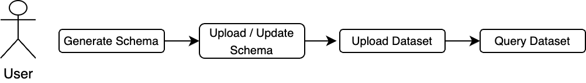
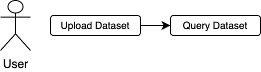

The rAPId API serves to make data storage and retrieval as easy and consistent as possible.

The API functionality includes:

- [Uploading a schema (i.e. creating a new dataset definition)](/api/routes/schema/)
  - Also creating a new version of an existing schema
- [Uploading data to any version of a dataset](/api/routes/dataset/#upload)
- [Listing available data](/api/routes/dataset/#list)
- [Querying data from any version of a dataset](/api/routes/dataset/#query)
- [Deleting data](/api/routes/dataset/#delete-data-file)
- Creating [users](/api/routes/user/#create) and [clients](/api/routes/client/#create)
- [Managing user and client permissions](/api/routes/subject/#modify-subject-permissions)

## Application Usage Overview

The first step is to create a dataset, which we can do by uploading a schema. This holds essential information about the dataset, such as: the columns, data types, version, data owner, tags etc.

After a schema has been uploaded, data can then be uploaded to the dataset. During the upload process, the API checks if the data matches the schema. This ensures that each of the datasets remain consistent.

## Data upload and query flows

### No schema exists + upload data + query

### Schema exists + upload data + query

### Schema exists + upload large dataset + query

