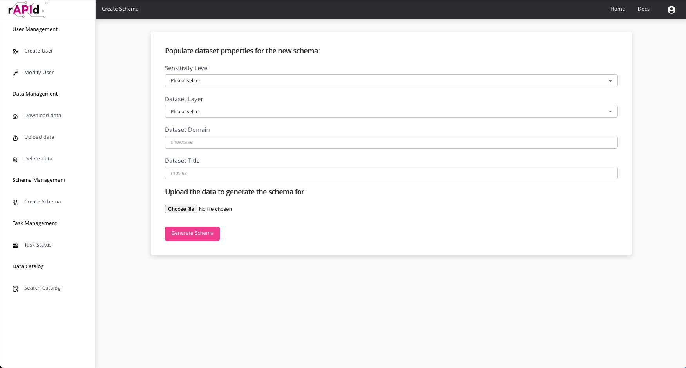
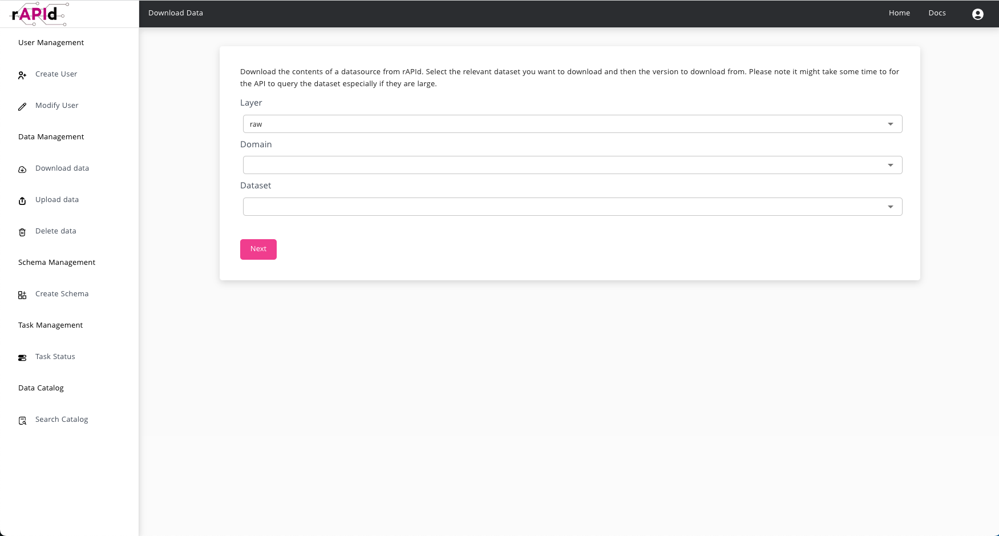

# Usage

The rAPId Frontend is a NextJS static site that serves as a user friendly wrapper to the API.

The Frontend provides easy access to the core actions within rAPId such as the ability to create schemas, upload and download data, as well as handling common user and client management.

> ## Demo Frontend coming soon!
>
> In lieu of a demo Frontend for you to use, here are some screenshots that demonstrate the functionality available.

## Creating Users

You can easily create users and set their permissions.

## Creating Schemas

You can create a schema by specifying just the `sensitivity`, `layer`, `domain` and `dataset title` then uploading an example file the data. rAPId will then infer the column names and types from the data and present them to you for review. You can then tweak them before submitting the schema for creation.

## Downloading Data

If a user has `READ` access to a dataset, they download it by selecting it from the dropdown and clicking through.

# Permissions

The Frontend automatically infers the permissions that the logged in user has access to and filters out what actions they can perform.

For example if a user does not have any user admin privileges then they will not be able to see any of the user and client creation interfaces.
