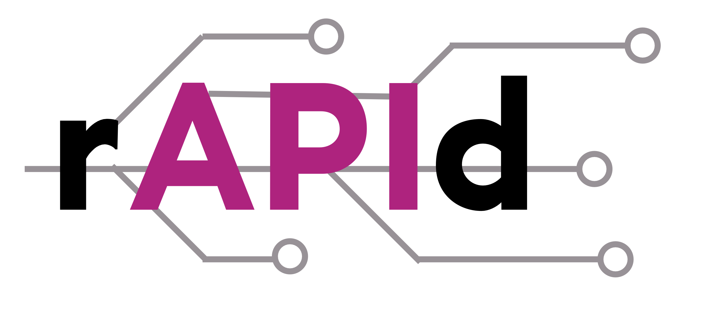

Project rAPId aims to create consistent, secure, interoperable data storage and sharing interfaces (APIs) that enable departments to discover, manage and share data and metadata amongst themselves.

Pioneered by 10 Downing Street, rAPId aims to improve the government's use of data by making it more scalable, secure, and resilient. Helping to match the rising demand for good-quality evidence in the design, delivery, and evaluation of public policy.

<!-- The project aims to deliver a replicable template for simple data storage infrastructure in AWS, a RESTful API and custom frontend UI to ingest and share named, standardised datasets. -->

# rAPId Structure

rAPId is comprised of several components that together form a replicable template for simple data storage infrastructure in AWS with a RESTful API and user-friendly UI. It allows the simple ingestion and sharing of standardised datasets.

## API

The rAPId API is a RESTful API built using FastAPI and Python. It handles all the serving for user management, schema definitions and data storage and retrieval.

## Infrastructure

The infrastructure allows you to quickly create all the resources necessary to host a new instance of rAPId. It is written in Terraform and allows you to deploy an instance of rAPId either within existing AWS infrastructure or within a blank account.

## UI

The UI is provided to make it easier to interact with the API when users would like to do so manually. It is built with NextJS and Typescript and is designed to be deployed as a static site and hosted through a Cloud Delivery Network (CDN) deployed from the infrastructure.

## SDK

The rAPId SDK is a lightweight Python package that acts as a wrapper around the API. It provides easy programmatic access to the core rAPId functionality and provides a set of common patterns when using rAPId with common data manipulation tools such as Pandas.
