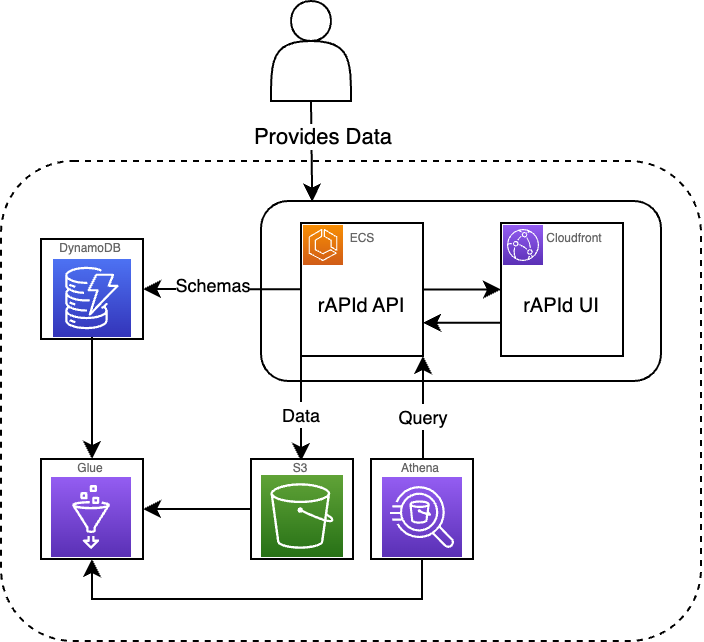

A high level overview of the rAPId infrastructure can be seen below including the flow of the core actions between the different services.

* When a user provides some data to rAPId. this data will be associated to a schema, this includes creating a schema for the first time as unseen data or retrieving a previously generated schema that matches the data.
* The contents of the schemas are stored as a DynamoDB item.
* Alongside storing the contents of the schema metadata, a glue table is created that corresponds to the schema metadata, the columns and their types aswell as the location within S3 that is used as the warehouse for this specific schema's data.
* When a user seeks to query data from rAPId an Athena SQL query is run against the corresponding Glue table and performs a query across all of the data files for the table.