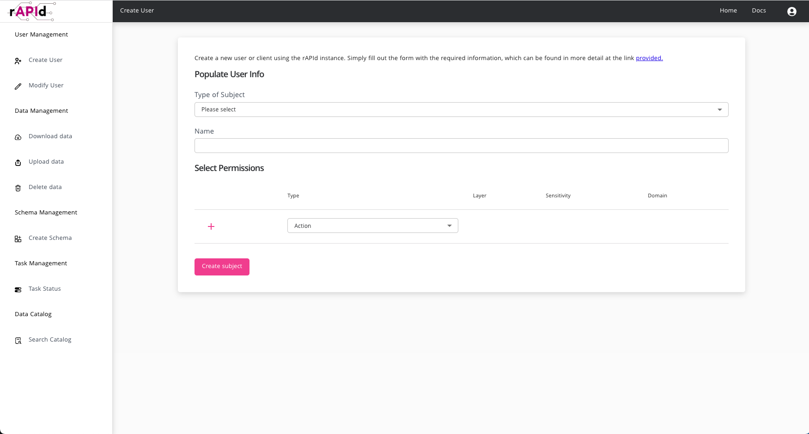
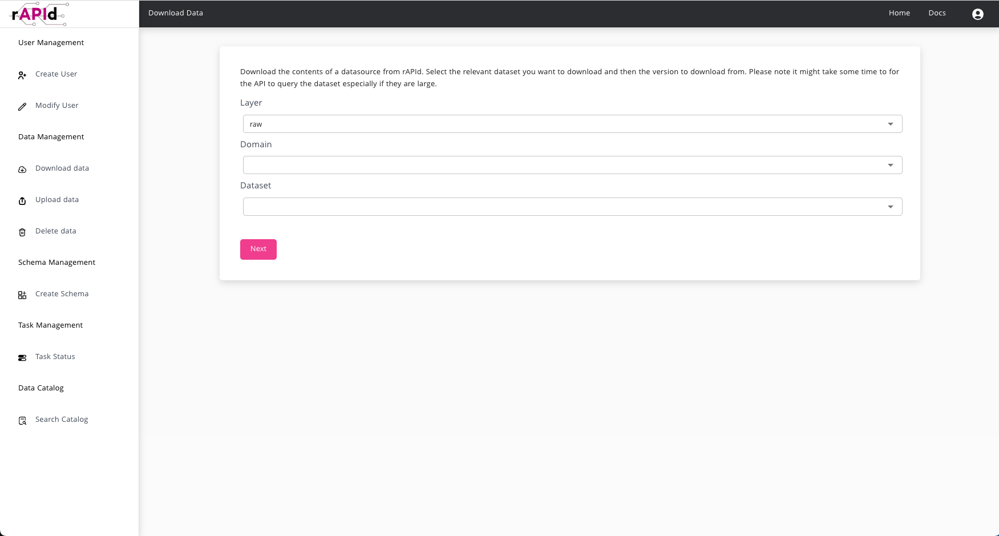

The rAPId UI is a NextJS static site that serves as a user friendly wrapper to the core rAPId API. It is not required as a package for the API but it is recommended as it provides a simple way to interact with the API.

# Dashboard

At a high level the UI provides easy access to the core actions within rAPId such as the ability to create schemas, upload and download data, aswell as handling common user and client management.

Common API actions are made easier with easy interfaces that when submitted makes requests to your self hosted rAPId instance, making all UI actions fully programmaticable.

## Creating Users

An easy to use user and client creation interface is provided where permissions can easily be set for each user and client.

## Creating Schemas

Creating a new schema is as easy as populating the domain and dataset information and then uploading your data file to which rAPId will automatically infer the schema from and present you with the schema for review. If you want to twweak column types or names you can do so before submitting the schema for creation.

## Downloading Data

If a user has access to a dataset then they can select which one they want to download aswell as a specific version of the dataset they desire.

# Permissions

The UI automatically infers the permissions that the logged in user has access too and filters out what actions they can perform. For example if a user does not have any user admin privileges then they will not be able to see any of the user and client creation interfaces.
